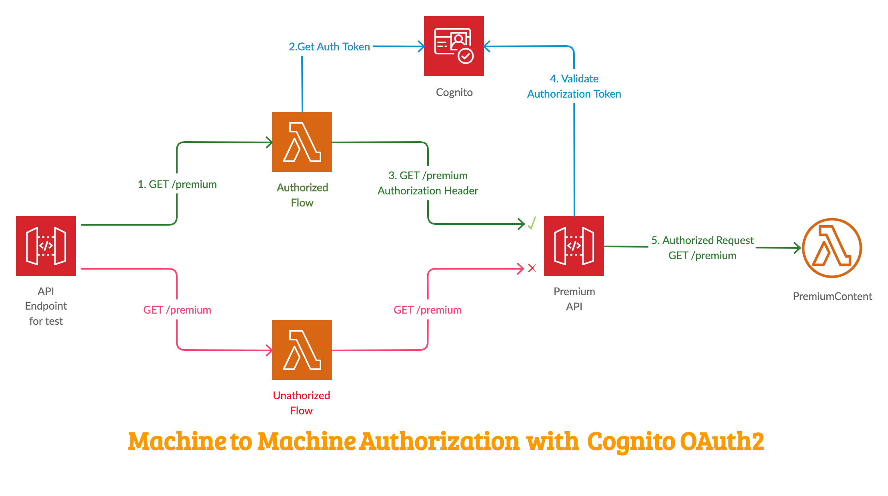
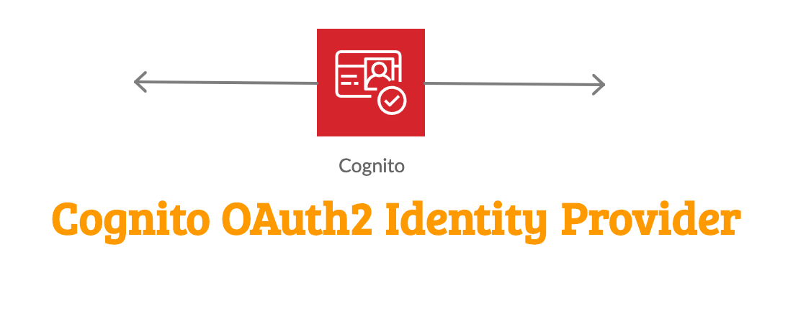
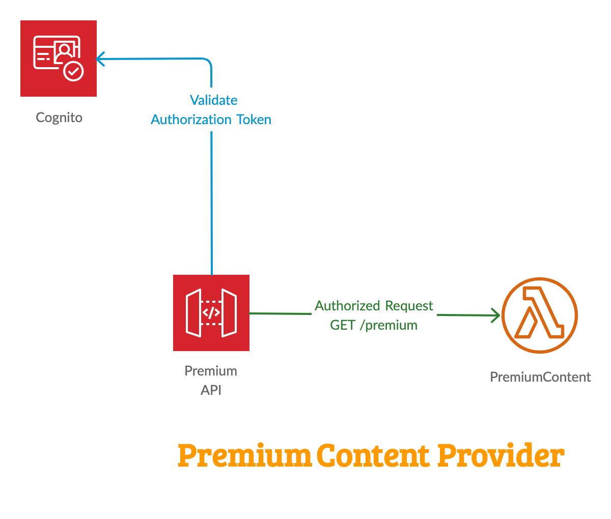
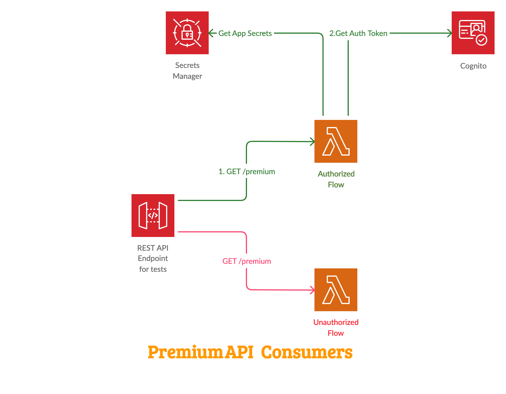

# Serverless API Authorizer

Authentication and Authorization are tough problem almost. Doing it right is not easy. You need to balance usability and security. When you are building serverless application, like an API, you would want your APIs to be accessible by authorized users.

Let us try and understand this with an example. Our start-up `Miztiik Corp` is a content publisher. Their platform leverage's serverless components like AWS Lambda & published their endpoints using AWS API Gateway. They want to authorize all access to their APIs serving premium content. They have adopted `OAuth` for the authorization as that gives them the flexibility to integrate with multiple identity providers. The authorization is handled AWS Cognito using OAuth.

The appropriate authorization flow for `Machine-To-Machine` or `API-To-API` communication is called _OAuth2 Client Credentials_, there is no user, or identity associated with the access request. The calling service obtains an access token, and the target service asserts that token to be valid before granting access to the protected data. The process is fairly straightforward,

1. The machine (i.e. script/Lambda/Requester) authenticates itself against a Cognito Endpoint with a list of desired scopes
1. Cognito verifies the credentials and checks if the machine is allowed to get these scopes
1. If the credentials are valid and the scopes can be granted, Cognito returns an Access Token to the machine
1. The machine can use that Access Token to Authenticate itself against the API-Gateway or an Application Load Balancer

`Scopes` are technically part of authorization. A scope more or less is a label that describes a capability such as **`READ_CONTENT`** or **`WRITE_CONTENT`**. You can create as many scopes as you like, but without further processing they are useless.

From the perspective of an _App_ you get information about which scopes the current request has been granted and you as the app owner is responsible for implementing authorization measures based on that.



In this article, we will build the above architecture. using Cloudformation generated using [AWS Cloud Development Kit (CDK)][102]. The architecture has been designed in a modular way so that we can build them individually and integrate them together. The prerequisites to build this architecture are listed below

1. ## 🧰 Prerequisites

   This demo, instructions, scripts and cloudformation template is designed to be run in `us-east-1`. With few modifications you can try it out in other regions as well(_Not covered here_).

   - 🛠 AWS CLI Installed & Configured - [Get help here](https://youtu.be/TPyyfmQte0U)
   - 🛠 AWS CDK Installed & Configured - [Get help here](https://www.youtube.com/watch?v=MKwxpszw0Rc)
   - 🛠 Python Packages, _Change the below commands to suit your OS, the following is written for amzn linux 2_
     - Python3 - `yum install -y python3`
     - Python Pip - `yum install -y python-pip`
     - Virtualenv - `pip3 install virtualenv`

1. ## ⚙️ Setting up the environment

   - Get the application code

     ```bash
     git clone https://github.com/miztiik/serverless-api-authorizer.git
     cd serverless-api-authorizer
     ```

1. ## 🚀 Prepare the dev environment to run AWS CDK

   We will cdk to be installed to make our deployments easier. Lets go ahead and install the necessary components.

   ```bash
   # If you DONT have cdk installed
   npm install -g aws-cdk

   # Make sure you in root directory
   python3 -m venv .env
   source .env/bin/activate
   pip3 install -r requirements.txt
   ```

   The very first time you deploy an AWS CDK app into an environment _(account/region)_, you’ll need to install a `bootstrap stack`, Otherwise just go ahead and deploy using `cdk deploy`.

   ```bash
   cdk bootstrap
   cdk ls
   # Follow on screen prompts
   ```

   You should see an output of the available stacks,

   ```bash
   cognito-identity-provider
   premium-content-provider
   content-consumers-stack
   ```

1. ## 🚀 Deploying the application

   Let us walk through each of the stacks,

   - **Stack: cognito-identity-provider**
     In this scenario, Cognito’s User Pool is merely a placeholder, as we will have no users. The only user will be the app client.
     
     This stack creates the following resources,

     - AWS Cognito Identity Pool to store identities
     - Cognito domain - to host the OAuth2 endpoint, `/oauth2/token`
     - An app client. Our `content consumers` will be using this app client to access premium content
     - Resource Server with custom scopes for `read` and `write`
     - We will be using the `client_credentials` OAuth flow, as we our scenario fits the `machine-to-machine` communication
     - We will store the `app_secrets` information like `app client id`, `app client secret` and `resource server identifier` and `app domain` in AWS Secrets Manager, which you can securely share with the downstream API consumer

     Initiate the deployment with the following command,

     ```bash
     cdk deploy cognito-identity-provider
     ```

   - **Stack: premium-content-provider**
     
     This stack creates the following resources,

     - A Lambda function that generates content dynamically. Supports
       - `read` scope for `GET` requests
       - `write` scope for `POST` requests
     - API Gateway Authorizer integrated with the `cognito-identity-provider`
     - API Gateway to validate the requests for `GET` & `POST` methods using cognito. Upon successful validation trigger Lambda and return response to requester.

     Initiate the deployment with the following command,

     ```bash
     cdk deploy premium-content-provider
     ```

     Check the `Outputs` section of the stack to access the `PremiumApiUrl`

   - **Stack: content-consumers-stack**

   

   Our consumers will have two different flows

   - _Unauthorized Access_
   - _Authorized Access_

   We will simulate them using AWS Lambda, triggered from API Gateway.

   This stack creates the following resources,

   - A Lambda function that can send different types of requests.
     - `{API_URL}/unauthorized-read`
     - `{API_URL}/authorized-read`
     - `{API_URL}/authorized-write`
   - API Gateway to make it easier for us to trigger the lambda, simulating an end user

   For each of the `authorized-{scope}` invocation, the lambda will make an request to `cognito-identity-provider` get the `access_token`. The request to cognito is faciliated by the `app_secrets` stored in AWS Secrets Manager by our `cognito-identity-provider` stack.

   Once we have the `access_token` we trigger the request to `premium-content-provider`

   Initiate the deployment with the following command,

   ```bash
   cdk deploy content-consumers-stack
   ```

   Check the `Outputs` section of the stack to access the `UnauthorizedUrl`, `AuthorizedReadUrl` and `AuthorizedWriteUrl`

1. ## 🔬 Testing the solution

   The _Outputs_ section of the `content-consumers-stack` stack has the required information on the urls

   - Access the `UnauthorizedUrl` in your browser. This will trigger an request to the `premium_api` without any authorization. This request is rejected by the API Gateway and you get an _unauthorized_ message as response.

   Expected Output,

   ```json
   {
     "message": "Unauthorized"
   }
   ```

   - When you access the `AuthorizedReadUrl`, The following happens,
     - The consumer(lambda) retrieves the `app secrets` from AWS Secrets Manager
     - Send an `POST` request to cognito with secrets. Cognito validates the `app id`, `app secret` and generates a `auth token` for the given scope (`read` in this case)
     - With this `auth token` make an `GET` request to `premium api`
     - API Gateway validates the `auth token` and on successful validation invokes the `premium content lambda`
     - Return the response back to requester.

   Expected Output,

   ```json
   {
     "message": "Premium Content: OAuth Scope: Read"
   }
   ```

   - When you access the `AuthorizedWriteUrl`, The following happens,
     - The consumer(lambda) retrieves the `app secrets` from AWS Secrets Manager
     - Send an `POST` request to cognito with secrets. Cognito validates the `app id`, `app secret` and generates a `auth token` for the given scope (`write` in this case)
     - With this `auth token` make an `POST` request to `premium api`
     - API Gateway validates the `auth token` and on successful validation invokes the `premium content lambda`
     - Return the response back to requester.

   Expected Output,

   ```json
   {
     "message": "Premium Content: OAuth Scope: Write"
   }
   ```

   You can check the logs in cloudwatch for more information or increase the logging level of the lambda functions by changing the environment variable from `INFO` to `DEBUG`

1. ## 🧹 CleanUp

   If you want to destroy all the resources created by the stack, Execute the below command to delete the stack, or _you can delete the stack from console as well_

   - Resources created during [deployment](#-resource-deployment-using-aws-cdk)
   - Delete CloudWatch Lambda LogGroups
   - _Any other custom resources, you have created for this demo_

   ```bash
   # Delete from cdk
   cdk destroy cognito-identity-provider

   # Follow any on-screen prompts

   # Delete the CF Stack, If you used cloudformation to deploy the stack.
   aws cloudformation delete-stack \
       --stack-name "MiztiikAutomationStack" \
       --region "${AWS_REGION}"
   ```

   This is not an exhaustive list, please carry out other necessary steps as maybe applicable to your needs.

## 📌 Who is using this

This repository teaches developers, Solution Architects & Ops Engineers how to build complete architecture in AWS. Based on that knowledge these Udemy [course #1][103], [course #2][102] have been created to enhance your skills.

### 💡 Help/Suggestions or 🐛 Bugs

Thank you for your interest in contributing to our project. Whether it's a bug report, new feature, correction, or additional documentation or solutions, we greatly value feedback and contributions from our community. [Start here][200]

### 👋 Buy me a coffee

[](https://ko-fi.com/Q5Q41QDGK)Buy me a [coffee ☕][900].

### 📚 References

1. [Control access to a REST API using Amazon Cognito User Pools as authorizer][1]

1. [Authorize API access using custom scopes in Amazon Cognito][2]

1. [Allow users to invoke API Gateway REST API/Lambda using the execution role from an Amazon Cognito user pool group][3]

1. [Server to Server Auth with Amazon Cognito][4]

1. [AWS API Gateway - using Access Token with Cognito User Pool authorizer?][5]

### 🏷️ Metadata

**Level**: 300

[1]: https://docs.aws.amazon.com/apigateway/latest/developerguide/apigateway-integrate-with-cognito.html
[2]: https://aws.amazon.com/premiumsupport/knowledge-center/cognito-custom-scopes-api-gateway/
[3]: https://aws.amazon.com/premiumsupport/knowledge-center/cognito-user-pool-group/
[4]: https://lobster1234.github.io/2018/05/31/server-to-server-auth-with-amazon-cognito/
[5]: https://stackoverflow.com/questions/50404761/aws-api-gateway-using-access-token-with-cognito-user-pool-authorizer/50617345#
[100]: https://www.udemy.com/course/aws-cloud-security/?referralCode=B7F1B6C78B45ADAF77A9
[101]: https://www.udemy.com/course/aws-cloud-security-proactive-way/?referralCode=71DC542AD4481309A441
[102]: https://www.udemy.com/course/aws-cloud-development-kit-from-beginner-to-professional/?referralCode=E15D7FB64E417C547579
[103]: https://www.udemy.com/course/aws-cloudformation-basics?referralCode=93AD3B1530BC871093D6
[200]: https://github.com/miztiik/cfn-challenges/issues
[899]: https://www.udemy.com/user/n-kumar/
[900]: https://ko-fi.com/miztiik
[901]: https://ko-fi.com/Q5Q41QDGK
